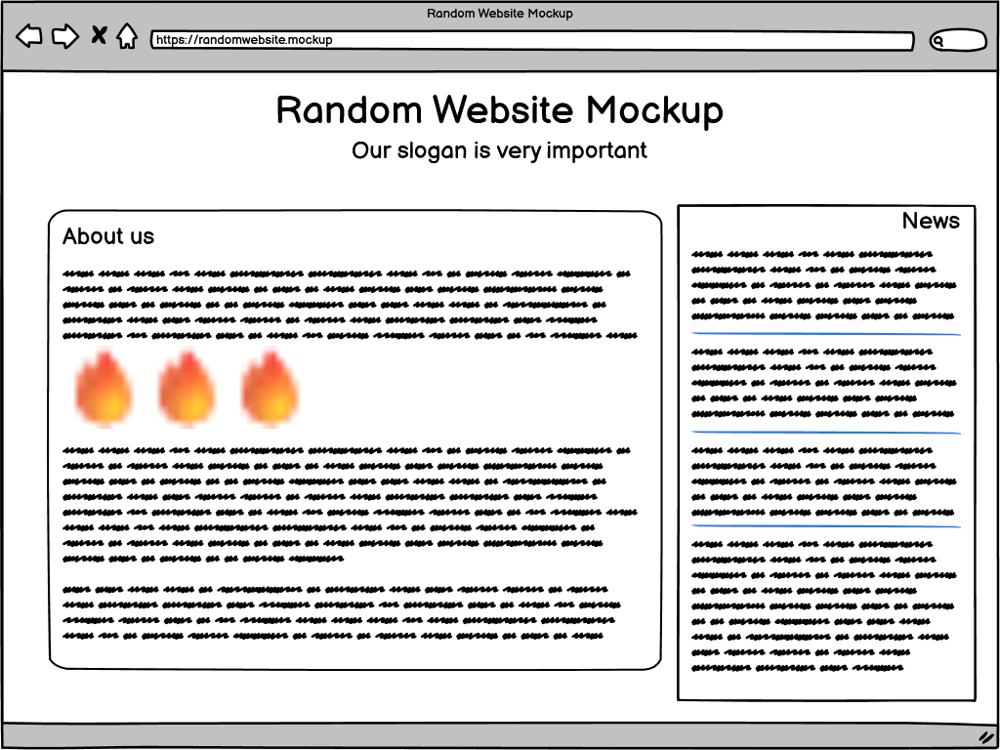

# Getting started with marker.js 3 and TypeScript

In this quick start guide we will create a very simple application that enables us to annotate an image with arrows and then both display the annotation as overlay and render the image with annotations embedded.

> Note: this quick start aims to demonstrate the core concepts in marker.js 3 and purposely ignores best practices and other considerations that would add to the bulk of code without contributing to helping you understand the main parts and principles.

## Setup

### Vite

We will use [Vite](https://vite.dev/) to scaffold the project and avoid covering the boilerplate code. To generate our initial project we will use the `vanilla-ts` template.

To get started create a directory of your choice and run this command in the terminal to create our project:

```bash
npm create vite@latest mjs3-quickstart-ts -- --template vanilla-ts
```

Follow the instructions on the screen to install dependencies. In case you need help with Vite, check out their [getting started guide](https://vite.dev/guide/).

### Add marker.js 3 dependency

To add marker.js 3 to the project run this command:

```bash
npm install @markerjs/markerjs3
```

### Target image

We will need a sample image to annotate. You can use any image you want, but if you don't have one handy, just use this one:



Save it in the `public` folder of the project. The rest of this tutorial assumes that you have a `sample-image.png` in your `public` directory.

## Adding annotation editor

We will try to make as few changes to the generated boilerplate as needed.

### index.html

In the main `index.html` page lets just add a button that would initiate creation of an arrow marker and a save button.

Just add these two buttons into the `app` div:

```html
<div id="app">
  <button id="addArrowButton">Add Arrow</button>
  <button id="saveButton">Save</button>
</div>
```

### main.ts

The core functionality will reside in the `src/main.ts` file. Open it and remove everything that was generated there except for the CSS import line:

```typescript
import './style.css';
```

#### Create target image object

Let's start by creating a target image object. We will need to pass it to the editor and later viewer and renderer.

Import the image file and create an image element:

```typescript
import sampleImage from '/sample-image.png';

const targetImg = document.createElement('img');
targetImg.src = sampleImage;
```

#### Get the app div reference

Let's store the reference to the `app` div in the `app` constant:

```typescript
const app = document.querySelector<HTMLDivElement>('#app');
```

#### Add MarkerArea

Now it's finally time to add the main annotation editor element - {@link Editor!MarkerArea | MarkerArea} from the marker.js 3 package.

First add an import for the `MarkerArea` class:

```typescript
import { MarkerArea } from '@markerjs/markerjs3';
```

And now we can create the `markerArea` instance, assign our sample image to it, and add it to the page:

```typescript
const markerArea = new MarkerArea();
markerArea.targetImage = targetImg;
app?.appendChild(markerArea);
```

#### Check the progress so far

Now if you start the dev server and navigate to the page you should see the sample image loaded:

```bash
npm run dev
```

It doesn't do anything yet, though.

#### Connecting the "Add Arrow" button

When the user clicks the "Add Arrow" button we want to initiate creation of an arrow marker. So, let's implement this.

Let's add an event handler to the button's `click` event:

```typescript
document
  .querySelector<HTMLButtonElement>('#addArrowButton')!
  .addEventListener('click', () => {
    markerArea.createMarker(ArrowMarker);
  });
```

All it needs to do is call the {@link Editor!MarkerArea.createMarker | MarkerArea.createMarker()} method and pass a marker type to create.

`createMarker()` works with strings as well, so you can pass `"ArrowMarker"` in place of the type, but we are in the TypeScript world so let's stick to the strongly typed code. For this code to work we would just need to add `ArrowMarker` to our marker.js import line.

```typescript
import { MarkerArea, ArrowMarker } from '@markerjs/markerjs3';
```

Now when you run the code and click on the "Add Arrow" button you should be able to draw arrows on the image.

#### The code so far...

The whole `main.ts` for this part should look something like this:

```typescript
import './style.css';
import sampleImage from '/sample-image.png';
import { MarkerArea, ArrowMarker } from '@markerjs/markerjs3';

// create the target image element
const targetImg = document.createElement('img');
targetImg.src = sampleImage;

// app div
const app = document.querySelector<HTMLDivElement>('#app');

// create the marker area, assign the target image and append it to the app div
const markerArea = new MarkerArea();
markerArea.targetImage = targetImg;
app?.appendChild(markerArea);

// add arrow marker button action
document
  .querySelector<HTMLButtonElement>('#addArrowButton')!
  .addEventListener('click', () => {
    markerArea.createMarker(ArrowMarker);
  });
```

## Adding annotation viewer

In the previous section we've added a "Save" button to the page. Let's hook it up to an event handler and display the state from the editor in an annotation viewer.

### main.ts

#### Add MarkerView

For simplicity, let's add {@link Viewer!MarkerView | MarkerView} instance to the page when it loads and hide it initially:

```typescript
const markerView = new MarkerView();
markerView.targetImage = targetImg;
app?.appendChild(markerView);
markerView.style.display = 'none';
```

Make sure you set its `targetImage` property to the same image we used in the editor. And don't forget to add `MarkerView` to your import:

```typescript
import { MarkerArea, ArrowMarker, MarkerView } from '@markerjs/markerjs3';
```

#### Handle the "Save" click

We are going to add an event listener to the "Save" button's `click` event, get the state (annotation) from the editor, and show it in the viewer:

```typescript
document
  .querySelector<HTMLButtonElement>('#saveButton')!
  .addEventListener('click', () => {
    const state = markerArea.getState();

    markerView.style.display = '';
    markerView.show(state);
  });
```

Don't forget to make the viewer visible by resetting its `display` style.

#### The code so far...

If you are going to create annotations, save them in some sort of storage or database, and then display them on the web that's pretty much the essence of what you need. Here's our complete `main.ts` up to this point:

```typescript
import './style.css';
import sampleImage from '/sample-image.png';
import { MarkerArea, ArrowMarker, MarkerView } from '@markerjs/markerjs3';

// create the target image element
const targetImg = document.createElement('img');
targetImg.src = sampleImage;

// app div
const app = document.querySelector<HTMLDivElement>('#app');

// create the marker area, assign the target image and append it to the app div
const markerArea = new MarkerArea();
markerArea.targetImage = targetImg;
app?.appendChild(markerArea);

// add arrow marker button action
document
  .querySelector<HTMLButtonElement>('#addArrowButton')!
  .addEventListener('click', () => {
    markerArea.createMarker(ArrowMarker);
  });

// add annotation viewer and hide it initially
const markerView = new MarkerView();
markerView.targetImage = targetImg;
app?.appendChild(markerView);
markerView.style.display = 'none';

// add save button action
document
  .querySelector<HTMLButtonElement>('#saveButton')!
  .addEventListener('click', () => {
    // get marker area state (annotation)
    const state = markerArea.getState();

    // display the state in the viewer
    markerView.style.display = '';
    markerView.show(state);
  });
```

## Rasterizing annotations

Saving and restoring annotation code is great when you work in an environment that includes marker.js. Oftentimes you'd need to export the annotations so you can share them with other people, archive, etc.

That's where the {@link Renderer!Renderer | Renderer} comes in. It takes the annotation state and renders it on top of the original target image. Let's add it to our code.

### main.ts

#### Add an image element to the page

Again, for simplicity, let's pre-add an image element for the rendered annotation to the page and hide it initially:

```typescript
const rasterImage = document.createElement('img');
app?.appendChild(rasterImage);
rasterImage.style.display = 'none';
```

#### Render the state

Now, we are going to extend our "Save" button click handler to render the image in addition to showing the viewer.

For this we will create an instance of the `Renderer` class, set its `targetImage` property to the same image we use everywhere and call its {@link Renderer!Renderer.rasterize | Renderer.rasterize()} method:

```typescript
const renderer = new Renderer();
renderer.targetImage = targetImg;
renderer.rasterize(state).then((dataUrl) => {
  rasterImage.src = dataUrl;
  rasterImage.style.display = '';
});
```

Note that `rasterize()` is an async method. You can call it using the async/await notation or you can just go the "classic" promises way like we did here. The `dataUrl` contains a base64 encoded rasterized image with annotations on top of the original. Now we just set it to the `src` attribute of our image element and make it visible.

And once again, remember to add an import for the `Renderer`:

```typescript
import {
  MarkerArea,
  ArrowMarker,
  MarkerView,
  Renderer,
} from '@markerjs/markerjs3';
```

And that's it. This concludes our quick walkthrough. Now when you draw some arrows and click save you should see a vector overlay of the annotation and a rendered version underneath.

## The complete code

Here's the complete content of our main.ts file:

```typescript
import './style.css';
import sampleImage from '/sample-image.png';
import {
  MarkerArea,
  ArrowMarker,
  MarkerView,
  Renderer,
} from '@markerjs/markerjs3';

// create the target image element
const targetImg = document.createElement('img');
targetImg.src = sampleImage;

// app div
const app = document.querySelector<HTMLDivElement>('#app');

// create the marker area, assign the target image and append it to the app div
const markerArea = new MarkerArea();
markerArea.targetImage = targetImg;
app?.appendChild(markerArea);

// add arrow marker button action
document
  .querySelector<HTMLButtonElement>('#addArrowButton')!
  .addEventListener('click', () => {
    markerArea.createMarker(ArrowMarker);
  });

// add annotation viewer and hide it initially
const markerView = new MarkerView();
markerView.targetImage = targetImg;
app?.appendChild(markerView);
markerView.style.display = 'none';

// add save button action
document
  .querySelector<HTMLButtonElement>('#saveButton')!
  .addEventListener('click', () => {
    // get marker area state (annotation)
    const state = markerArea.getState();

    // display the state in the viewer
    markerView.style.display = '';
    markerView.show(state);

    // render the annotation to an image
    const renderer = new Renderer();
    renderer.targetImage = targetImg;
    renderer.rasterize(state).then((dataUrl) => {
      rasterImage.src = dataUrl;
      rasterImage.style.display = '';
    });
  });

// image element for the rendered annotation
const rasterImage = document.createElement('img');
app?.appendChild(rasterImage);
rasterImage.style.display = 'none';
```

And you can find this whole project on [GitHub](https://github.com/ailon/markerjs3-quick-starts/tree/main/mjs3-quickstart-ts)

{@include ./next-steps.md}
